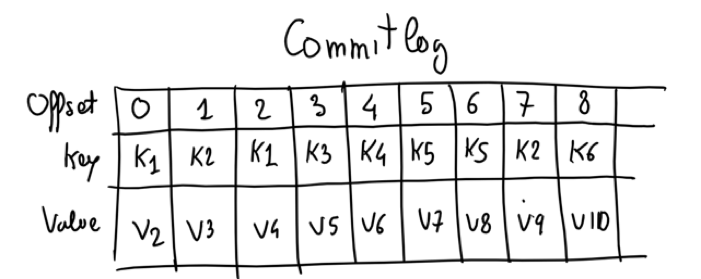

### The World's most simple database	

```bash
#!/bin/bash 

db_set () {     
	echo "$1,$2" >> db 

} 

db_get () { 
	grep "^$1," db | sed -e "s/^$1,//" | tail -n 1 
}
```

^ db_set is appending data to a file. This is generally quite efficient.

Indeed, many databases internally use the same strategy, but it is not a normal file, is a log.

### The Log

A log is an append-only sequence of records. It doesn’t have to be human-readable; it might be binary and intended only for other programs to read.



^ Questions:
- What is the cost of lookup O(n)
- What is the cost of write O(1)
- What is the cost of read from the head O(1).

